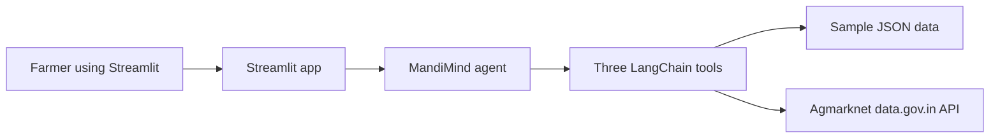

# MandiMind

https://mandi-mind-suq7zkmcdaksyjcnq7lrem.streamlit.app/

MandiMind is a small AI Agents project I built to explore a practical question a farmer may face: should I sell my crop in the local mandi today, or is another market in the state offering a noticeably better price? The app looks up mandi prices, compares markets, checks recent price movement, and explains the suggestion in plain language.

## What I built

I wanted the project to show an agent workflow without hiding everything behind a large framework. The agent has three tools. It first checks the local mandi price, then compares markets in the state, and then checks the recent trend for the relevant markets. Only after collecting those facts does it write the final suggestion.



I kept the project intentionally small. There is no database, login system, forecasting model, or logistics calculation. The point is to demonstrate how an agent can use tools, reason from returned facts, and show its work.

## How the request flows

1. The user enters a commodity, quantity, state, and district.
2. The agent calls `get_mandi_prices` to check the local district.
3. It calls `compare_nearby_markets` to rank markets in the selected state by modal price.
4. It calls `get_price_trend` for the local market and the best alternate market.
5. If another market is at least 5% higher, the app suggests considering it. Otherwise, it suggests selling locally.
6. The app displays the tool calls and outputs under **How the agent reached this answer**.

The final amount is a gross comparison only. It does not include transport, commission, storage, or other selling costs.

## Project files

- `app.py`: the Streamlit page and result display.
- `agent/tools.py`: the three LangChain tools.
- `agent/agent.py`: the small agent workflow and recommendation rule.
- `agent/llm.py`: optional OpenAI or Anthropic provider selection.
- `data/agmarknet_client.py`: sample-data loading and live API request.
- `data/sample_data.json`: Maharashtra demo data with 84 dated price records.

## Setup

Use Python 3.11 or newer.

```bash
python -m venv venv
```

Activate the environment:

```bash
# Windows PowerShell
venv\Scripts\Activate.ps1

# macOS or Linux
source venv/bin/activate
```

Install the packages:

```bash
pip install -r requirements.txt
```

Copy the environment example and keep sample mode enabled for the easiest demo:

```bash
copy .env.example .env
```

On macOS or Linux:

```bash
cp .env.example .env
```

Then run the app:

```bash
streamlit run app.py
```

## Configuration

The app runs with `USE_SAMPLE_DATA=true`, even if no LLM key is available. A real OpenAI or Anthropic key only improves the wording of the recommendation. The recommendation logic and tool trace still work without one.

To use the live government dataset, set `USE_SAMPLE_DATA=false` and add a free `DATA_GOV_API_KEY` from [data.gov.in](https://data.gov.in/resource/current-daily-price-various-commodities-various-markets-mandi). If the API is unavailable, the project falls back to its local sample data so the demo can still run.

## Queries to try

- “50 quintals of onion in Nashik, Maharashtra. Should I sell here or elsewhere?”
- “What are the best markets for potato in Maharashtra?”
- “Is the onion price trend in Lasalgaon rising or falling?”

## Portfolio note

This is a portfolio PoC that uses a free government mandi-price dataset. It is meant to demonstrate data tools, a simple AI-agent workflow, and a clear Streamlit interface. It is not financial advice and should not be used as the only basis for a real selling decision.
